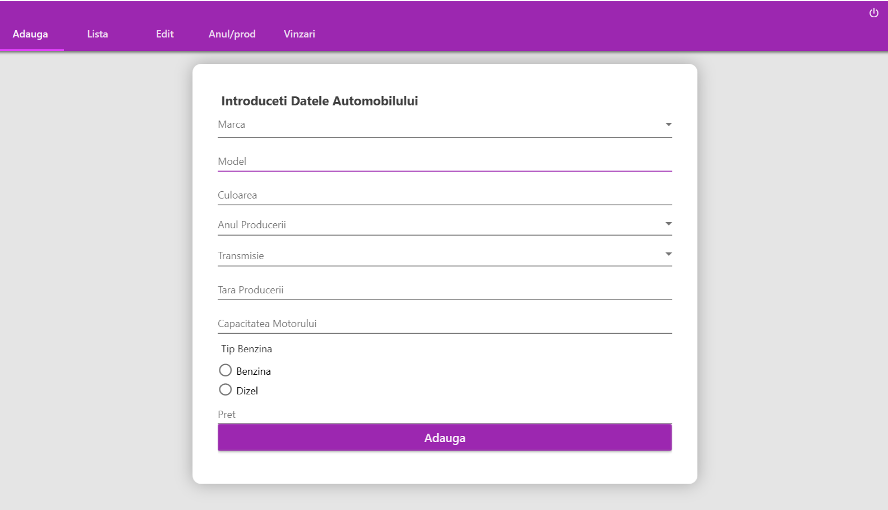

# C#-project
The app was developed using C#, MSSQL. The app's purpose is to manage an auto dealer. As a user, we are greeted by a page to add a new car; in the next tab, we have a list of the vehicles in our database, and we can sort according to the model, country, year, and price. In the next tab, we can edit a car, and depending on the situation, and we can mark it as sold; in that case, we need to add the customer information. And in the last tab, we can see a graph of our sales during the year. 
Main menu: 

